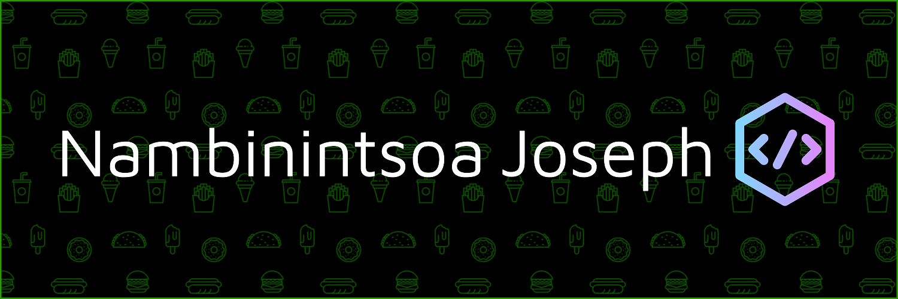

<h1>I'm Nambinintsoa Joseph</h1>

- 💬 Ask me about **JavaScript** or **PHP**
- 🗨 How to reach me **raznambinintsoa3@gmail.com**

<h2 align="left">Skills & tools :</h2>

	
	
	
	
	
	
	
	
	
	
	
	
		

	  

